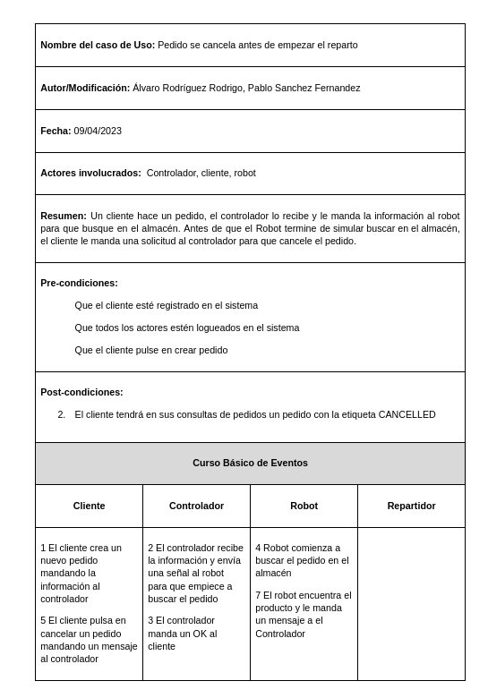

# Índice
1. [Introdución](#introduccion)
2. [Definición del proyecto](#definicion)
3. [Implementacion](#Implementación)
4. [Conclusiones](#conclusiones)

# 1. Introducción
El objetivo de Saimazoom es el de crear un sistema para la gestión de pedidos online. Este sistema debe incluir a los actores:
* **Cliente**, que realiza y gestiona pedidos de productos.
* **Controlador** central, que gestiona todo el proceso, gestiona también la base de datos y sus accesos a ella.
* **Robots**, que se encargan de buscar los productos en el almacén y colocarlos en las cintas transportadoras.
* **Repartidores**, encargados de transportar el producto a la casa del cliente

El sistema debe de gestionar las interacciones entre todos estos actores, para las comunicaciones correspondientes se empleará una cola de mensajes.

# 2. Definición del proyecto
El sistema Saimazoom, como conjunto, debe gestionar pedidos, en los que los **clientes** pueden solicitar un producto. Una vez recibido un pedido, el **controlador** debe avisar a un **robot**, que mueve dicho producto del almacén a la cinta transportadora. Una vez en la cinta transportadora, el controlador avisa a un **repartidor**, que lleva el producto a la casa del **cliente**. 
<!-- Las comunicaciones pertinentes entre estos elementos estarán gestionadas por un **controlador** central, que mantiene la comunicación entre los **clientes**, **robots** y **repartidores**. -->

## 2.1. Objetivos y funcionalidad
Los objetivos principales son: 
* La gestión de los pedidos de los **clientes**, que pueden hacer, ver  y cancelar pedidos.
* La gestión de los **robots**, que reciben ordenes de de transportar los productos del almacen a la cinta transportadora.
* La gestión de los **repartidores**, que reparten los productos que hay en la cinta transportadora a la casa de los clientes.
* La gestión del **controlador** central, que tiene que mantener un control de productos, **clientes**, **robots** y **repartidores**. Tiene que guardar también los pedidos, con sus estados, que dependen de la relación con el resto de actores.
* La comunicación entre el **controlador** y el resto de actores

Para cumplir estos objetivos es necesario desarrollar una serie de funcionalidades básicas:
1. Registro de **Cliente**: registro desde una petición de un **Cliente** con un identificador de **cliente** que tiene que ser único.
2. Registro de Pedido: registro en la base de datos del **controlador** central con un id de **cliente** y de producto, también le asigna un estado al pedido.
3. Recepción de pedidos de los **Clientes**: hay que recibir y guardar los pedidos a realizar que están asociados a un **Cliente** y a un producto.
4. Asignación de trabajo a los **Robots**: hay que asignar a los **robots** las tareas de transporte de productos correspondientes a pedidos.
5. Asignación de trabajo a los **Repartidores**: hay que asignar a los **repartidores** las tareas de transporte de productos correspondientes a pedidos.

## 2.2. Requisitos
Nos limitaremos a los requisitos funcionales, estos los podemos dividir en los siguientes apartados:

### 2.2.1. **Lógica de clientes**
*  **LoCl1**. Registro en la aplicación en el que se recibe confirmación  
*  **LoCl2**. Realizar un pedido, en el que se pide un producto  
*  **LoCl3**. Pedir una lista de los pedidos realizados en la que se incluya id del producto correspondiente al pedido y estado del pedido  
*  **LoCl4**. Pedir la cancelación de un pedido

### 2.2.2. **Lógica de controlador**
*  **LoCo1**. Enviar mensajes al resto de actores del sistema con confirmaciones o peticiones
*  **LoCo2**. Modificar los estados del pedido en cada momento

### 2.2.3. **Lógica de robot**
*  **LoRo1**. Verificar si un pedido existe en el almacen

### 2.2.4. **Lógica de repartidor**
*  **LoRe1**. Intentar entregar pedidos con una capacidad de tres reintentos

# 3. Implementación
En este punto incluiremos toda la parte de analisis y diseño del sistema:
* ## 3.1 Diagrama de clases
    
* ## 3.2 Diagrama de estados de un pedido
    
* ## 3.3 Casos de Uso
* ### 3.3.1 Pedido Completado hasta el final
     
* ### 3.3.2 Pedido en el que el robot no encuentra el producto
    
* ### 3.3.3 Pedido que se cancela antes de empezar el reparto
     
* ## 3.3 Descripción de los mensajes (sintaxis y formato):
* Para empezar, para tener el diseño de la práctica más claro, desarrollamos un diagrama de colas de mensaje
    
* En nuestro caso, la cola entre cliente y controlador será una cola del tipo RPC y el resto de colas serán asincronas. La estructura de los mensajes será:
* **Controlador->Cliente**
 &emsp;**Registro:**
 &emsp; &emsp;body = "ESTADO" (REGISTERED, OK, ERROR)
  &emsp;**RealizarPedido:**
 &emsp; &emsp;body = "ESTADO" (OK)
 &emsp;**CancelarPedido:**
 &emsp; &emsp;body = "ESTADO" (ERROR, OK)
 &emsp;**VerPedido:**
 &emsp; &emsp;body = PEDIDOS_CLIENTE (cursor_obj.fetchall)

* **Cliente->Controlador**
 &emsp;**Registro:**
 &emsp; &emsp;body = "nombre_registro" (String)
 &emsp;**Menu:**
 &emsp; &emsp;body = "CASE" (1: Crear Pedido, 2: Ver pedido, 3: Cancelar Pedido)

* **Controlador->Robot**
 &emsp;**BuscarPedido:**
 &emsp; &emsp;body = "id_pedido"

* **Robot->Controlador**
 &emsp;**ResultadoBusqueda:**
 &emsp; &emsp;body = "N|id_pedido" (N=0: No encontrado, N=1: Encontrado)

* **Controlador->Repartidor**
 &emsp;**IntentoEntrega**
 &emsp; &emsp;body = "id|intento_nº" (intento_nº={0,1,2})

* **Repartidor->Controlador**
 &emsp;**ResultadoEntrega**
 &emsp; &emsp;body = "N|id|intento_nº" (N=0: No entregado, N=1: Entregado) (intento_nº={0,1,2})

# 4. Conclusiones
    En resumen, hemos modificado un poco el planteamiento inicial ya que en nuestro caso no habrá un actor "ADMIN". El actor ADMIN todo lo que hacía era manejar la base de datos y que la comunicación entre todos los actores fuera correcta asi que hemos hecho que nuestro controlador hiciera tanto el papel de admin como el papel de controlador.

    El programa está diseñado para que funcione con varios repartidores, robots y clientes. 

    Para comenzar la primera vez que se lance el programa será necesario o bien crear la base de datos manual mente o bien lanzar el controlador con el argumento cleanDB. Este argumento te sirve tanto como para limpiar la base de datos como para crearla inicialmente.

    Hemos tenido dudas entre las diferencias entre commandline_client.py y launch_client.py

    En general el proyecto tiene un funcionamiento bastante correcto y hemos cumplido toda la funcionalidad pedida. 
    Las funcionalidades están probadas en los tests unitarios.
